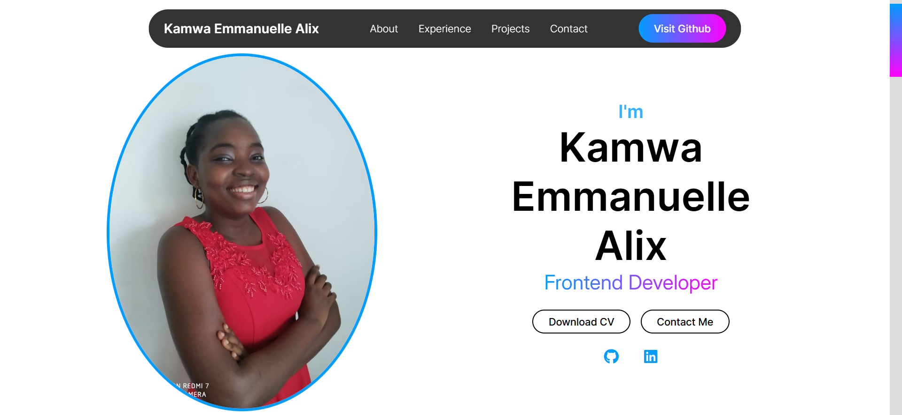

# CodeAlpha_Portfolio

> Working with HTML, CSS and JavaScript

In this project, I have created a portfolio website using HTML, CSS, and JavaScript, included experience section, about section, recent projects section, and contact section.

## Built With

-   HTML,
-   CSS
-   JAVASCRIPT

[Live Demo Link](https://code-alpha-portfolio-amber.vercel.app/)

## Author

👤 **Emmanuelle Kamwa**

-   Github: [@emmanuellekamwa](https://github.com/emmanuellekamwa)
-   Twitter: [@AlixKamwa](https://twitter.com/AlixKamwa)
-   Linkedin: [emmanuelle-kamwa-86145a1a4](https://www.linkedin.com/in/emmanuelle-kamwa-86145a1a4/)

# Show Some Support

Give a ⭐ if you've liked my project and your comments are highly accepted.